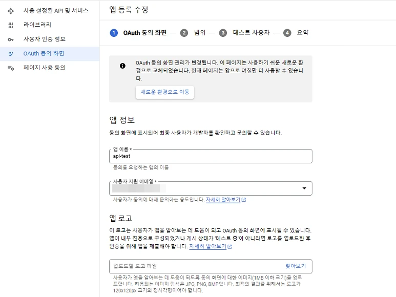

# 구글 API에서 Client ID, Secret Key 값과 JSON Key 파일 확인하기 (클라이언트 ID, 보안 비밀번호)

---

구글 클라우드(Google Cloud)에서 제공하는 각종 API 기능(ex. 구글 소셜 로그인 기능 등)을 활용하려면, 클라우드 콘솔에서 앱 생성 및 클라이언트 ID(Client ID), 보안 비밀번호(Secret Key) 값을 요구하는 경우가 많습니다.경우에 따라서는 JSON 형태로 제공되는 Key 파일을 이용할 때도 있지요. 그래서, 이런 값들을 어디서 확인하는지 알아보도록 하겠습니다.

## 구글 클라우드 앱 생성하기

---

### 프로젝트 생성

우선은 [구글 클라우드 콘솔](https://console.cloud.google.com/)로 접속해 줍니다. 만약 만들어둔 프로젝트가 있다면 아래의 [OAuth 설정](#OAuth-%EC%84%A4%EC%A0%95)으로 이동해 주시기 바랍니다.

클라우드 콘솔 페이지에서 로고 옆을 보면, 프로젝트 이름을 선택할 수 있습니다. 여기를 누르면 새 프로젝트를 생성할 수 있지요. 새 프로젝트 버튼을 누른 뒤, 요청하는 정보를 입력하면 완성입니다.

입력할 값은 프로젝트 이름과 ID, 위치 정도입니다. 프로젝트 생성에 성공했다면, 구글 클라우드 로고 옆에 원하는 프로젝트 이름이 제대로 선택되었는지 확인해 주세요.

### OAuth 설정

다음으로는 API 및 서비스 메뉴에 접속해 줍니다. OAuth 동의 화면 메뉴를 선택한 뒤, User Type은 내부 및 외부 중 원하는 타입을 골라주세요. 제한된 이용자만 사용하는 경우가 아니라면 외부를 선택하는 것이 좋습니다.

나머지 앱 정보는 필요한만큼 입력해 두시면 됩니다. 기본적으로는 앱 이름 및 사용자 지원 이메일 등의 필수 요소만 적어주시면 됩니다.

## Client ID, Secret Key 값과 JSON Key 파일 확인하기

---

같은 화면에서 사용자 인증 정보 메뉴를 선택하면 사용자 인증 정보 만들기 메뉴를 찾을 수 있습니다. 우리는 여기에서 OAuth 클라이언트 ID를 등록할겁니다.

새로 OAuth 클라이언트를 만들면 클라이언트 ID(Client ID)와 보안 비밀번호(Secret Key)를 즉시 조회할 수 있습니다. 팝업의 왼쪽 아래를 살펴보면 JSON 다운로드 버튼이 있는걸 확인할 수 있는데, 여기서 Key 정보가 기록된 JSON 파일을 얻을 수 있습니다.

만약 해당 정보를 잊어버렸거나 다시 JSON 파일을 다운로드해야 한다면, 생성된 사용자 인증 정보(OAuth 2.0 클라이언트 항목에 등록되어 있습니다)의 오른쪽 끝에 다운로드 버튼을 눌러보면 위와 같이 다시 정보를 조회하거나 JSON 파일을 다운로드할 수 있습니다.

---

이렇게 클라이언트 ID와 보안 비밀번호를 확인해 두면, 개발 또는 이용하는 프로그램에서 요구하는 값을 입력해 두시면 됩니다. 이 값의 경우, 유출될 경우 각 계정별로 제공되는 구글 클라우드의 API 요청량을 소모하기 때문에 함부로 공유하지 말아주세요. 만약 실수로 공개된 장소에 업로드하거나 해킹을 당했다면, 생성한 앱을 삭제한 뒤 위의 방법에 따라 새로 생성해 주시기 바랍니다.
